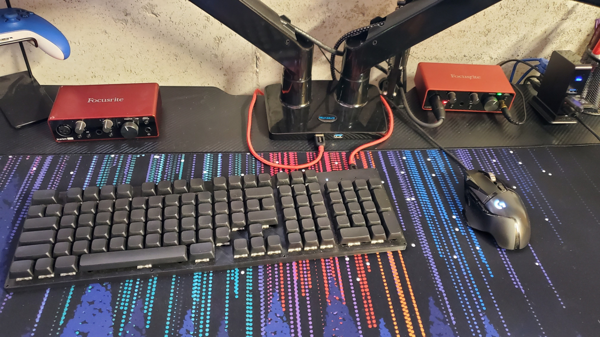

# BadABoard
<h3>Over 9000% keyboard with macro keys.</h3>

A tad over 100% ortholinear keyboard that replaces navigation/editing keys with macros that have yet to be implemented. Based on the RP2040 this is one powerful keyboard that can't do aynthing a basic keyboard can't... yet. I plan on creating a version with RGB LEDs and smaller versions as well. After my battery cell project I might make a bluetooth version as well. Currently the only thing holding back further development is a properly modeled case.

